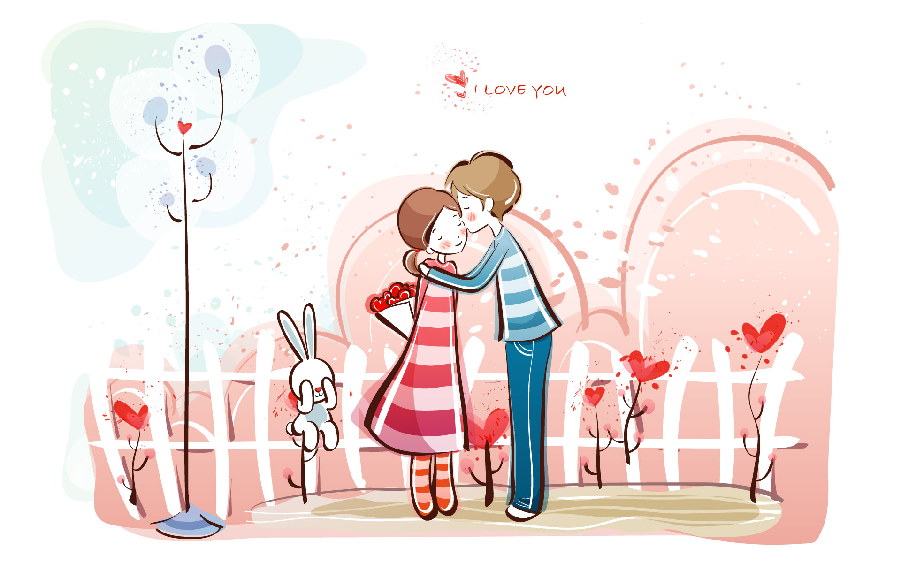

# -valentine-proposal
<!DOCTYPE html>
<html lang="en">
<head>
    <meta charset="UTF-8">
    <meta name="viewport" content="width=device-width, initial-scale=1.0">
    <title>Valentine's Day Proposal</title>
    
</head>
<body>
    

        <h1>Will You Be My Valentine?</h1>
        
        
Dear kaijomellowmarshbloonjaancutiepie,

        
I've been thinking about you a lot, and I was wondering if you would be my Valentine. I would love to spend Valentine's Day with you and make it special.

        
Please let me know what you think.

        <button id="yes" onclick="showSweetMessage()">Yes</button>
        <button id="no" onclick="showNoMessage()">No</button>
    

    
</body>
</html>
